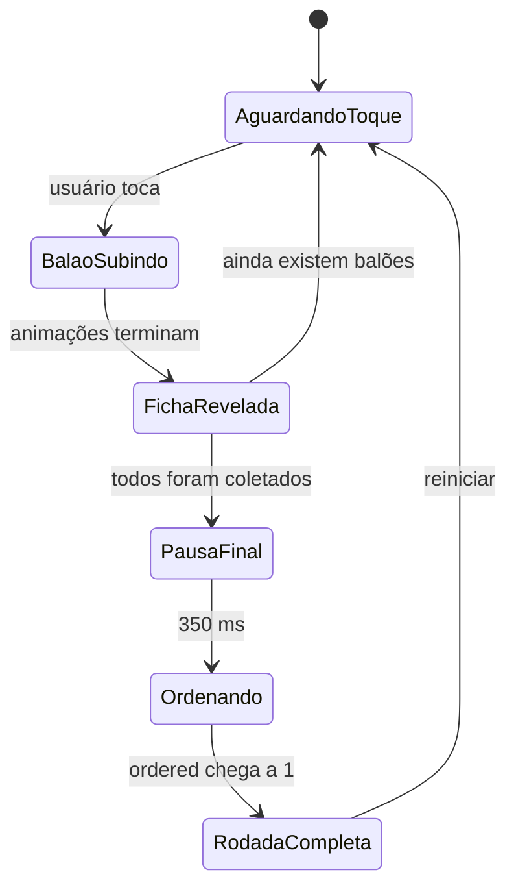
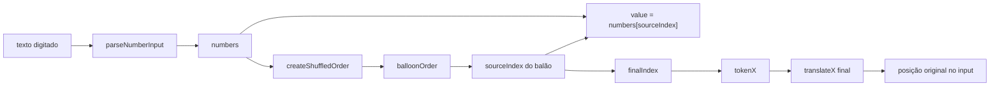
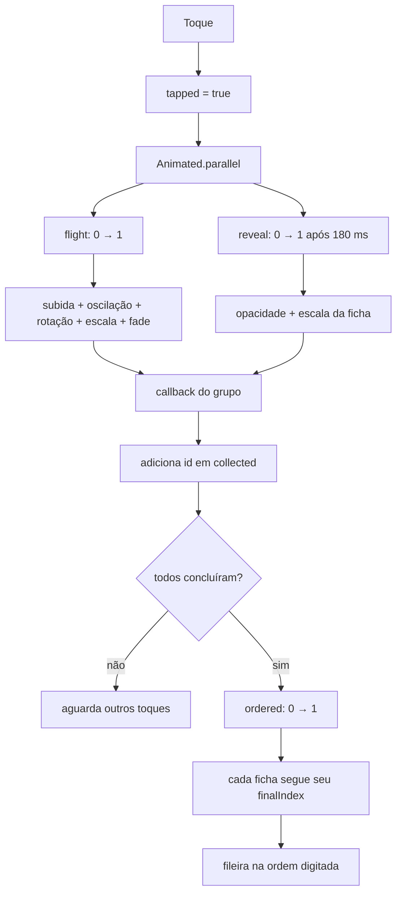

# Lógica detalhada das animações

## 1. Propósito deste documento

Este documento descreve em profundidade o sistema de animações implementado em `App.tsx` no projeto **Balloon Sequence**.

O objetivo não é apenas listar quais animações existem, mas explicar:

- quais estados e valores animados participam de cada etapa;
- como o toque do usuário inicia o fluxo;
- como um único valor numérico gera vários movimentos visuais;
- como as animações individuais se comunicam com o componente principal;
- como as fichas calculam suas posições iniciais e finais;
- como ocorre a sincronização entre subida, revelação e ordenação;
- por que determinadas propriedades podem usar o native driver;
- como o reset devolve todos os componentes ao estado inicial;
- quais problemas podem surgir ao modificar tamanhos, tempos ou quantidade de balões;
- como evoluir a solução sem criar condições de corrida ou inconsistências visuais.

As explicações refletem a versão atual do código. A constante `BALLOONS` contém seis balões e o contador utiliza `BALLOONS.length`, mantendo a interface alinhada à configuração.

## 2. Visão geral da experiência

O fluxo visual completo é dividido em três fases:

1. **Estado inicial:** todos os balões estão visíveis e as fichas estão invisíveis atrás deles.
2. **Revelação individual:** cada toque faz um balão subir enquanto sua ficha aparece.
3. **Agrupamento coletivo:** depois que todos os balões terminam suas animações, todas as fichas se movem juntas para uma fileira que preserva a ordem digitada.



Cada balão possui sua própria animação de subida e sua própria animação de revelação. A ordenação final, por outro lado, usa um único valor compartilhado por todas as fichas.

## 3. Elementos que participam da animação

Há cinco grupos principais de elementos:

### 3.1. `Pressable`

É a única área que recebe o toque. Sua posição corresponde à posição inicial do balão e cobre somente o corpo visível: `72 × 74` no azul e `72 × 80` no amarelo. O fio e os componentes SVG internos usam `pointerEvents="none"` e não recebem eventos.

### 3.2. `Animated.View` do balão

Contém um componente SVG azul ou amarelo com corpo, brilho, nó e logotipo. Os `viewBox` foram recortados para os limites da arte visível (`117 16 112 115` no azul e `98 22 102 112` no amarelo). O `Animated.View` mede `72 × 74` no azul ou `72 × 80` no amarelo, sem offsets negativos. O corpo se desloca, gira, muda de escala e desaparece durante a subida.

### 3.3. Camada animada do fio

Cada balão renderiza uma camada SVG do tamanho do palco com um único `Path` Bézier. `getStringPath` liga o nó ao ponto-base `(102, 400)`, na ponta da mão direita da capivara. Cada fio recebe uma variação horizontal inferior a quatro pontos para formar um feixe visível. A camada fica atrás dos outros elementos e sua opacidade deriva de `flight`, desaparecendo durante os primeiros 22% da subida.

### 3.4. `Animated.View` da ficha

Existe desde a primeira renderização, mas começa invisível e com escala zero. Ela não é criada depois do toque; ela já está posicionada abaixo do balão e apenas passa a ser visível.

### 3.5. Componente principal `App`

Controla o progresso global da rodada, identifica quando todos os balões foram coletados e inicia a ordenação coletiva.

## 4. Constantes geométricas

O sistema usa constantes para manter o cálculo visual previsível:

```ts
const BALLOON_SIZE = 72;
const TOKEN_SIZE = 48;
const FINAL_TOP = 28;
const FINAL_LEFT = 4;
const FINAL_GAP = 52;
```

### `BALLOON_SIZE`

Define a largura-base do corpo do balão. O corpo possui 72 pontos de largura e 82 de altura, porque sua altura é calculada como `BALLOON_SIZE + 10`.

### `TOKEN_SIZE`

Define largura e altura da ficha. Como o `borderRadius` usa metade desse valor, a ficha se torna circular.

### `FINAL_TOP`

É a coordenada vertical desejada para todas as fichas depois da ordenação. Ao final, todas devem estar com `top` visual equivalente a 28 dentro do palco.

### `FINAL_LEFT`

É a base do cálculo horizontal da primeira ficha. Na implementação atual, a margem horizontal aplicada à ficha adiciona um deslocamento visual extra de 12 pontos; isso será detalhado na seção sobre coordenadas.

### `FINAL_GAP`

É a distância entre o início de uma ficha e o início da próxima. Como a ficha possui 48 pontos e o intervalo é 52, existe um espaço visual de aproximadamente 4 pontos entre elas.

## 5. Sistema de coordenadas

Todas as posições dos balões e fichas são relativas ao `stage`:

```ts
stage: {
  width: 340,
  height: 440,
  marginTop: 10,
  overflow: 'visible',
}
```

O palco possui 340 pontos de largura e 440 de altura. Os elementos usam `position: 'absolute'`, portanto `left` e `top` são medidos a partir do canto superior esquerdo do palco.

O eixo horizontal cresce para a direita:

```text
x = 0 ------------------------------------> x = 340
```

O eixo vertical cresce para baixo:

```text
y = 0
  |
  |
  v
y = 440
```

Por isso, um `translateY` negativo move o balão para cima.

## 6. Dados de posição inicial

Cada balão possui `x` e `y`:

```ts
type BalloonData = {
  id: number;
  x: number;
  y: number;
  color: string;
};
```

Essas coordenadas são aplicadas à área de toque:

```tsx
style={[styles.balloonHitArea, {left: item.x, top: item.y}]}
```

Portanto:

- `item.x` determina a posição horizontal do balão;
- `item.y` determina a posição vertical do balão;
- as transformações animadas são aplicadas a partir dessa posição-base;
- a animação não altera permanentemente `left` ou `top` do balão.

Usar transformações em vez de alterar `top` e `left` durante a animação é importante porque `translateX` e `translateY` podem ser executados pelo native driver.

## 7. Valores animados

O sistema possui três tipos de valores de controle.

| Valor | Escopo | Estado inicial | Estado final | Responsabilidade |
|---|---|---:|---:|---|
| `flight` | Um por balão | 0 | 1 | Subida e desaparecimento do balão |
| `reveal` | Um por ficha | 0 | 1 | Entrada, escala e opacidade da ficha |
| `ordered` | Um por rodada | 0 | 1 | Movimento coletivo para a fileira final |

Os valores não representam pixels diretamente. Eles funcionam como um **progresso normalizado**, em que:

- `0` significa início;
- valores intermediários representam progresso parcial;
- `1` significa fim.

As interpolações convertem esse progresso em pixels, graus, escala e opacidade.

## 8. Por que `useRef` é usado

Os valores são criados assim:

```ts
const flight = useRef(new Animated.Value(0)).current;
const reveal = useRef(new Animated.Value(0)).current;
```

E, no componente principal:

```ts
const ordered = useRef(new Animated.Value(0)).current;
```

`useRef` preserva a mesma instância entre renderizações. Isso é essencial porque o componente pode renderizar novamente quando `collected`, `numbers` ou outro estado muda.

Se um novo `Animated.Value` fosse criado em toda renderização:

- a referência usada pela animação em andamento poderia ser perdida;
- a animação poderia retornar para zero;
- os estilos poderiam passar a observar uma instância diferente;
- movimentos em andamento poderiam piscar ou ser interrompidos.

O `.current` retorna diretamente o objeto `Animated.Value`, deixando seu uso mais simples.

## 9. Diferença entre estado React e valor animado

`collected` e `round` são estados React. Quando mudam, provocam uma nova renderização.

`flight`, `reveal` e `ordered` são valores animados. Eles mudam muitas vezes por segundo, mas não provocam uma renderização React para cada quadro.

Essa separação é intencional:

- React controla mudanças estruturais e lógicas;
- `Animated` controla mudanças visuais contínuas;
- o app evita renderizar toda a árvore a 60 ou 120 quadros por segundo.

## 10. Início do fluxo pelo toque

O toque chega à função `pop`:

```ts
const pop = () => {
  if (tapped.current) {
    return;
  }
  tapped.current = true;

  Animated.parallel([...]).start(() => onPop(item.id));
};
```

O fluxo é:

1. verificar se o balão já foi tocado;
2. marcar imediatamente o balão como tocado;
3. criar e iniciar as duas animações em paralelo;
4. aguardar o término do grupo;
5. informar ao componente principal que o balão foi coletado.

## 11. Bloqueio de toques duplicados

O controle é feito com:

```ts
const tapped = useRef(false);
```

No primeiro toque, `tapped.current` passa para `true` antes de iniciar a animação.

Isso evita o seguinte problema:

```text
toque 1 -> inicia flight 0 -> 1
toque 2 -> tentaria iniciar flight 0.12 -> 1 novamente
toque 3 -> criaria outro callback de conclusão
```

Sem a proteção, o mesmo `id` poderia tentar ser contabilizado várias vezes e várias animações poderiam disputar o mesmo valor.

Foi usado `useRef`, e não `useState`, porque:

- a mudança não precisa atualizar a interface;
- a escrita é síncrona;
- o segundo toque enxerga imediatamente o valor `true`;
- não há espera por uma nova renderização.

## 12. Execução paralela

A subida e a revelação são agrupadas com:

```ts
Animated.parallel([
  Animated.timing(flight, {...}),
  Animated.spring(reveal, {...}),
]).start(() => onPop(item.id));
```

`Animated.parallel` inicia as animações do array como parte de um mesmo grupo.

Isso não significa que ambas começam visualmente no mesmo instante, porque a animação `reveal` possui `delay: 180`. Significa que o grupo gerencia as duas animações em conjunto.

A callback passada a `start` é executada quando o grupo termina. Na prática, o balão só é marcado como coletado depois que:

- o `timing` de subida terminou;
- a `spring` de revelação terminou de se estabilizar.

## 13. Linha do tempo de um toque

```mermaid
gantt
    title Linha do tempo aproximada de um balão
    dateFormat x
    axisFormat %L ms
    section Balão
    Subida, oscilação e escala :flight, 0, 650
    Fade final                 :fade, 488, 162
    section Ficha
    Atraso                     :delay, 0, 180
    Entrada elástica           :reveal, 180, 500
```



O tempo da `spring` é aproximado. Diferentemente de `timing`, ela não usa uma duração fixa; termina quando o sistema de massa, rigidez e amortecimento se estabiliza.

O fade começa em 75% do progresso do `flight`:

```text
650 ms × 0,75 = 487,5 ms
```

Assim, o balão permanece totalmente opaco durante aproximadamente os primeiros 488 milissegundos e desaparece nos últimos 162 milissegundos.

## 14. `Animated.timing` da subida

```ts
Animated.timing(flight, {
  toValue: 1,
  duration: 650,
  easing: Easing.out(Easing.cubic),
  useNativeDriver: true,
})
```

### `toValue: 1`

Faz o progresso sair de 0 e chegar a 1.

### `duration: 650`

Define 650 milissegundos para o percurso principal.

### `Easing.out(Easing.cubic)`

A curva cúbica de saída inicia mais rapidamente e reduz a velocidade perto do final.

Conceitualmente:

```text
velocidade
alta  |\
      | \
      |  \
baixa |   \____
      +---------- tempo
```

Isso transmite a sensação de que o balão recebe um impulso inicial e perde velocidade ao se afastar.

## 15. Movimento vertical

```ts
translateY: flight.interpolate({
  inputRange: [0, 1],
  outputRange: [0, -480],
})
```

A conversão é linear entre os dois extremos:

| `flight` | `translateY` aproximado |
|---:|---:|
| 0 | 0 px |
| 0,25 | -120 px |
| 0,50 | -240 px |
| 0,75 | -360 px |
| 1 | -480 px |

O sinal negativo move para cima. A distância de 480 é maior que a altura do palco, garantindo que o balão ultrapasse o limite superior.

Como `stage` usa `overflow: 'visible'`, a simples saída dos limites do palco não recorta o balão. O desaparecimento definitivo depende também da opacidade animada.

## 16. Oscilação horizontal

```ts
translateX: flight.interpolate({
  inputRange: [0, 0.35, 0.7, 1],
  outputRange: [0, 9, -7, 4],
})
```

Essa interpolação possui quatro pontos-chave:

| Progresso | Deslocamento | Efeito |
|---:|---:|---|
| 0 | 0 px | posição original |
| 0,35 | +9 px | movimento para a direita |
| 0,70 | -7 px | cruzamento para a esquerda |
| 1 | +4 px | pequena correção final |

O movimento cria uma trajetória em “S”. A interpolação calcula automaticamente todos os valores entre cada par de pontos.

Exemplo simplificado:

```text
       direita
          /
origem --/  \________
                   \__ direita final
         esquerda
```

## 17. Rotação

```ts
rotate: flight.interpolate({
  inputRange: [0, 0.5, 1],
  outputRange: ['0deg', '7deg', '-5deg'],
})
```

O balão começa sem rotação, inclina 7 graus em uma direção na metade do caminho e termina inclinado 5 graus na direção oposta.

A combinação entre `rotate` e `translateX` é o que faz a subida parecer orgânica. Usar somente `translateY` produziria um movimento reto e mecânico.

## 18. Escala do balão

```ts
scale: flight.interpolate({
  inputRange: [0, 0.25, 1],
  outputRange: [1, 1.08, 0.92],
})
```

O balão:

1. começa com 100% do tamanho;
2. cresce até 108% no primeiro quarto da animação;
3. diminui gradualmente até 92% ao sair.

O crescimento inicial funciona como antecipação visual. A redução final reforça a percepção de afastamento.

## 19. Opacidade do balão

```ts
opacity: flight.interpolate({
  inputRange: [0, 0.75, 1],
  outputRange: [1, 1, 0],
})
```

De 0 a 0,75, a opacidade permanece em 1. De 0,75 a 1, cai gradualmente até 0.

Não existe fade no começo. Isso mantém a forma nítida durante quase toda a subida e evita que a ficha pareça substituir um balão sem presença física.

## 20. Ordem das transformações

As transformações são declaradas nesta ordem:

```ts
transform: [
  {translateY: ...},
  {translateX: ...},
  {rotate: ...},
  {scale: ...},
]
```

A ordem deve ser tratada como parte da composição visual. Alterá-la pode modificar o resultado, especialmente quando rotação e escala são combinadas com translações.

Uma boa regra é manter as translações primeiro e as transformações de aparência depois, a menos que exista uma intenção visual específica para mudar o referencial.

## 21. Spring da ficha

```ts
Animated.spring(reveal, {
  toValue: 1,
  delay: 180,
  damping: 11,
  stiffness: 160,
  mass: 0.65,
  useNativeDriver: true,
})
```

A spring simula um sistema físico.

### `stiffness: 160`

Representa a rigidez da mola. Valores maiores tendem a puxar o valor com mais força para o destino.

### `damping: 11`

Representa a resistência ao movimento. Valores menores permitem mais oscilação; valores maiores estabilizam mais rapidamente.

### `mass: 0.65`

Representa a massa do objeto. A massa menor deixa a resposta mais rápida e leve.

### Resultado visual

A ficha cresce rapidamente, pode ultrapassar levemente a escala 1 e então se estabiliza. Esse pequeno excesso é o “pop” elástico da revelação.

## 22. Um valor controlando opacidade e escala

`reveal` é aplicado em duas propriedades:

```tsx
opacity: reveal,
transform: [
  ...,
  {scale: reveal},
]
```

Quando `reveal = 0`:

- opacidade = 0;
- escala = 0;
- a ficha não é visível.

Quando `reveal = 0.5`:

- opacidade = 0,5;
- escala = 0,5, desconsiderando eventual overshoot da spring.

Quando `reveal = 1`:

- opacidade = 1;
- escala = 1.

Usar o mesmo valor mantém a aparição e o crescimento sincronizados.

## 23. Por que a ficha já existe antes do toque

A ficha é renderizada independentemente de `collected`. Isso oferece algumas vantagens:

- nenhuma montagem de componente é necessária no meio da animação;
- o native driver pode receber a árvore visual antes do início;
- a posição inicial já está calculada;
- a ficha aparece apenas mudando propriedades animáveis;
- a animação não depende de uma renderização React depois do toque.

Ela usa `pointerEvents="none"`, então não intercepta toques destinados aos balões.

## 24. Posição inicial da ficha

A ficha usa:

```ts
left: item.x + (BALLOON_SIZE - TOKEN_SIZE) / 2,
top: item.y + 8,
```

Como:

```text
(72 - 48) / 2 = 12
```

o cálculo de `left` adiciona 12 pontos para centralizar a ficha de 48 dentro do balão de 72.
Não são usadas margens horizontais na ficha. Isso é importante para que a fórmula de translação leve exatamente ao destino calculado, sem um deslocamento adicional da fileira.

## 25. Cálculo da ordem final

A posição final não é calculada a partir do valor numérico nem diretamente do identificador do balão. `balloonOrder` é uma permutação dos índices da entrada. Cada balão consulta um `sourceIndex` nessa permutação e usa o mesmo índice para buscar o conteúdo e definir o destino:

```tsx
const sourceIndex = balloonOrder[item.id - 1];

value={numbers[sourceIndex]}
finalIndex={sourceIndex}
```

Esse vínculo não pode ser perdido: `value` informa o que a ficha mostra e `finalIndex` registra de qual posição digitada aquela ocorrência veio.

Exemplo:

```text
numbers       = [3, 2, 5, 1, 2, 5]
balloonOrder  = [1, 2, 5, 4, 0, 3]
nos balões    = [2, 5, 5, 2, 3, 1]
ordem final   = [3, 2, 5, 1, 2, 5]
```

| Balão | `sourceIndex` | Valor | `finalIndex` |
|---:|---:|---:|---:|
| 1 | 1 | 2 | 1 |
| 2 | 2 | 5 | 2 |
| 3 | 5 | 5 | 5 |
| 4 | 4 | 2 | 4 |
| 5 | 0 | 3 | 0 |
| 6 | 3 | 1 | 3 |

Não existe `sort`, ranking numérico ou desempate. Valores repetidos continuam rastreáveis porque cada ocorrência conserva seu índice, mesmo quando duas fichas exibem o mesmo conteúdo.

## 26. Destino horizontal da ficha

O destino é calculado por:

```ts
const tokenX = FINAL_LEFT + finalIndex * FINAL_GAP;
```

Com os valores atuais:

| `finalIndex` | `tokenX` |
|---:|---:|
| 0 | 4 |
| 1 | 56 |
| 2 | 108 |
| 3 | 160 |
| 4 | 212 |
| 5 | 264 |

Essa tabela representa a coordenada horizontal final de cada ficha.

## 27. Transformação horizontal final

A interpolação é:

```ts
translateX: ordered.interpolate({
  inputRange: [0, 1],
  outputRange: [0, tokenX - item.x - 12],
})
```

O deslocamento final é a diferença entre destino e origem.

A origem calculada pelo `left` é `item.x + 12`. Assim:

```text
deslocamento = tokenX - (item.x + 12)
deslocamento = tokenX - item.x - 12
```

Somando origem e deslocamento:

```text
(item.x + 12) + (tokenX - item.x - 12) = tokenX
```

Como não existe margem horizontal adicional, a posição visual termina exatamente em `tokenX`.

## 28. Transformação vertical final

A interpolação é:

```ts
translateY: ordered.interpolate({
  inputRange: [0, 1],
  outputRange: [0, FINAL_TOP - item.y - 8],
})
```

A origem vertical da ficha é:

```text
top inicial = item.y + 8
```

O deslocamento necessário é:

```text
deslocamento = FINAL_TOP - (item.y + 8)
deslocamento = FINAL_TOP - item.y - 8
```

Somando origem e deslocamento:

```text
(item.y + 8) + (FINAL_TOP - item.y - 8) = FINAL_TOP
```

Por isso, independentemente da posição inicial do balão, todas as fichas terminam na mesma linha vertical.

## 29. Exemplo completo de deslocamento

Considere uma ficha com:

```text
item.x = 151
item.y = 210
finalIndex = 2
```

O destino horizontal é:

```text
tokenX = 4 + 2 × 52
tokenX = 108
```

O `translateX` final é:

```text
108 - 151 - 12 = -55
```

O `translateY` final é:

```text
28 - 210 - 8 = -190
```

Logo, quando `ordered` chega a 1, essa ficha se deslocou 55 pontos para a esquerda e 190 pontos para cima.

## 30. Valor compartilhado `ordered`

`ordered` pertence ao componente `App` e é enviado para todos os componentes `Balloon`.

```tsx
ordered={ordered}
```

Cada ficha observa o mesmo progresso, mas possui `outputRange` próprio porque sua origem e seu `finalIndex` são diferentes.

Isso produz o seguinte comportamento:

```text
ordered = 0,00 -> todas nas posições dos balões
ordered = 0,25 -> todas percorreram 25% de seus próprios trajetos
ordered = 0,50 -> todas percorreram 50%
ordered = 1,00 -> todas chegaram aos destinos na ordem digitada
```

As distâncias são diferentes, mas a duração é compartilhada. Por isso, fichas que precisam percorrer caminhos maiores se movem mais rapidamente em pixels por segundo.

## 31. Detecção do fim da fase individual

Quando o `Animated.parallel` termina normalmente, ele chama:

```ts
]).start(({finished}) => {
  if (finished) {
    onPop(item.id);
  }
});
```

O sinalizador `finished` diferencia uma conclusão real de um cancelamento provocado pelo reset. Uma animação interrompida pode executar seu callback com `finished: false`; nesse caso, a rodada não deve registrar o balão.

No componente principal, `onPop` aponta para `handlePop`.

```ts
const handlePop = useCallback((id: number) => {
  setCollected(current => {
    if (current.includes(id)) {
      return current;
    }

    return [...current, id];
  });
}, []);
```

A forma funcional `setCollected(current => ...)` é importante porque vários balões podem estar animando ao mesmo tempo.

Cada callback recebe o estado mais recente, mesmo que outras animações tenham terminado quase simultaneamente.

## 32. Concorrência entre vários balões

O usuário não precisa esperar um balão terminar para tocar em outro. Portanto, podem existir várias animações `flight` e `reveal` ativas ao mesmo tempo.

Exemplo:

```text
t = 0 ms   -> toca balão 1
t = 80 ms  -> toca balão 4
t = 140 ms -> toca balão 2
```

Cada instância possui seus próprios valores e sua própria proteção `tapped`. Quando terminarem, poderão chamar `handlePop` em ordens diferentes.

O array `collected` representa ordem de conclusão, não necessariamente ordem de toque. Para a lógica atual isso não importa, porque ele é usado apenas para:

- impedir duplicação;
- contar quantos terminaram;
- esconder o balão finalizado;
- saber quando todos terminaram.

## 33. Por que verificar duplicação duas vezes

Há proteção local com `tapped.current` e proteção global com:

```ts
if (current.includes(id)) {
  return current;
}
```

As duas proteções atuam em níveis diferentes:

- `tapped` impede reiniciar a animação da instância;
- `current.includes(id)` protege a integridade do estado global.

Mesmo que uma futura modificação provoque duas chamadas de `onPop`, o contador não avançará duas vezes para o mesmo balão.

## 34. Remoção visual do balão

Enquanto `collected` é falso, o balão é renderizado:

```tsx
{!collected && (
  <Pressable>...</Pressable>
)}
```

O balão primeiro chega a opacidade zero pelo `flight`. Somente depois que o grupo termina e `collected` é atualizado o `Pressable` é removido da árvore React.

Essa ordem evita uma remoção brusca antes do fim da saída.

A ficha não fica dentro dessa condição, então permanece renderizada depois que o balão desaparece.

## 35. Disparo da ordenação final

O fim da fase individual é representado pelo estado derivado:

```ts
const isComplete = collected.length === BALLOONS.length;
```

Um efeito observa esse estado e controla o ciclo de vida da animação final:

```ts
useEffect(() => {
  if (!isComplete) {
    return;
  }

  const orderingAnimation = Animated.timing(ordered, {
    toValue: 1,
    delay: 350,
    duration: 900,
    easing: Easing.inOut(Easing.cubic),
    useNativeDriver: true,
  });

  orderingAnimation.start();
  return () => orderingAnimation.stop();
}, [isComplete, ordered]);
```

O uso de `BALLOONS.length` mantém a condição lógica alinhada à quantidade real configurada. Separar o efeito do atualizador de `setCollected` também é essencial: o React pode executar esse atualizador durante seu processamento interno, e iniciar uma animação nele causaria uma atualização nativa em uma fase na qual efeitos não são permitidos.

Na configuração atual, a ordenação começa quando os seis balões foram coletados.

## 36. Pausa antes da ordenação

`delay: 350` cria uma pausa entre a última revelação e o movimento coletivo.

Essa pausa tem função narrativa:

1. o usuário vê o último número;
2. percebe que a fase de descoberta terminou;
3. depois observa a reorganização.

Sem pausa, a última ficha começaria a sair da posição assim que terminasse de aparecer, reduzindo a legibilidade.

## 37. Curva da ordenação

A ordenação usa:

```ts
Easing.inOut(Easing.cubic)
```

Essa curva possui três momentos:

- aceleração suave no início;
- velocidade maior na região central;
- desaceleração suave na chegada.

É adequada para elementos que partem de um estado estável e chegam a outro estado estável.

Isso difere da subida, que usa `Easing.out` porque representa um impulso já iniciado.

## 38. Linha do tempo da conclusão

```text
último toque
    |
    | flight + reveal do último balão
    v
último onPop
    |
    | collected chega a BALLOONS.length
    | pausa de 350 ms
    v
ordered: 0 -> 1 durante 900 ms
    |
    v
fichas na ordem digitada
```

O tempo total entre o último toque e o fim da ordenação é aproximadamente:

```text
tempo do grupo individual + 350 ms + 900 ms
```

Como a spring não possui duração fixa, o primeiro termo é variável.

## 39. Native driver

Todas as animações usam:

```ts
useNativeDriver: true
```

O native driver permite serializar o grafo da animação para o lado nativo. Depois de iniciado, o movimento de propriedades compatíveis não depende de uma mensagem JavaScript a cada quadro.

Benefícios:

- maior estabilidade visual quando a thread JavaScript está ocupada;
- menos comunicação pela bridge/camada de integração;
- menor risco de quadros perdidos;
- transformações mais suaves.

## 40. Propriedades compatíveis com o native driver

O código anima apenas propriedades adequadas:

- `opacity`;
- `transform.translateX`;
- `transform.translateY`;
- `transform.rotate`;
- `transform.scale`.

Ele não anima diretamente:

- `left`;
- `top`;
- `width`;
- `height`;
- cores de fundo;
- margens.

Essas propriedades permanecem estáticas e servem como base para as transformações.

## 41. Z-index e camadas

O balão usa:

```ts
zIndex: 5
```

A ficha usa:

```ts
zIndex: 2
```

Consequentemente, antes da saída, o balão fica visualmente acima da ficha. Isso reforça a impressão de que o número estava escondido atrás dele.

Quando o balão desaparece e seu `Pressable` é removido, a ficha permanece visível.

No Android, `elevation` também é usado para as sombras, mas `elevation` e `zIndex` não devem ser tratados como exatamente a mesma coisa. O primeiro influencia elevação/sombra e pode influenciar composição; o segundo expressa a ordem de empilhamento no layout React Native.

## 42. Sombras durante as transformações

As sombras fazem parte dos elementos transformados.

No balão, a sombra se move e escala junto com o corpo porque está aplicada na `View` interna que faz parte do grupo animado.

Na ficha, a sombra acompanha a escala e as translações do `Animated.View`.

Sombras podem ter diferenças visuais entre iOS e Android. As propriedades `shadowColor`, `shadowOpacity`, `shadowRadius` e `shadowOffset` são principalmente do iOS, enquanto `elevation` fornece o efeito principal no Android.

## 43. Reset das animações

A função de reset executa:

```ts
const reset = () => {
  ordered.stopAnimation();
  ordered.setValue(0);
  setCollected([]);
  setRound(current => current + 1);
  setHasStarted(false);
};
```

Cada linha possui uma responsabilidade diferente.

### `ordered.setValue(0)`

Move imediatamente o progresso global para o estado inicial. As fichas voltariam às posições originais caso continuassem montadas.

### `setCollected([])`

Marca todos os balões como não coletados.

### Incremento de `round`

Força a recriação das instâncias `Balloon`.

### `setHasStarted(false)`

Libera novamente o campo para edição. Os valores digitados são preservados, permitindo repetir a rodada ou editar a sequência antes do próximo toque.

## 44. Por que `round` é necessário

A chave de cada balão é:

```tsx
key={`${round}-${item.id}`}
```

Quando `round` muda, a chave muda. Para o React, isso significa que o elemento antigo foi removido e um novo elemento foi criado.

Essa remontagem recria:

- `flight` com valor 0;
- `reveal` com valor 0;
- `tapped` com valor `false`.

Sem mudar a chave, os componentes manteriam seus refs:

- `flight` continuaria em 1;
- `reveal` continuaria em 1;
- `tapped` continuaria verdadeiro;
- o balão não poderia ser tocado novamente corretamente.

## 45. Reset durante uma animação ativa

Na implementação atual, o botão pode ser pressionado mesmo enquanto balões estão subindo.

O incremento de `round` desmonta os componentes antigos e monta novos. Durante essa desmontagem, o cleanup de cada balão interrompe os valores animados:

```ts
useEffect(
  () => () => {
    flight.stopAnimation();
    reveal.stopAnimation();
  },
  [flight, reveal],
);
```

Como o callback do grupo verifica `finished`, o cancelamento não chama `handlePop` e não altera `collected` depois do reset.

## 46. Input numérico e relação com animação

O input não é uma animação, mas determina o conteúdo e o destino de cada ficha. `parseNumberInput` só atualiza `numbers` quando existem exatamente seis valores válidos.

O array `numbers` preserva a entrada, e `balloonOrder` associa cada balão a um índice de origem. Esse `sourceIndex` seleciona o valor e também se torna o `finalIndex`. Por sua vez, `finalIndex` define `tokenX`, que define o `outputRange` do `translateX`.



O campo é bloqueado assim que o primeiro balão inicia sua animação. Isso impede que valores e destinos mudem no meio da rodada. O reset devolve `ordered` a zero e libera o input.

## 47. Valores repetidos e posições finais

O conteúdo da ficha não participa do cálculo da posição. Por isso, valores repetidos não exigem ranking ou desempate: cada ocorrência usa seu `sourceIndex`.

Exemplo:

```text
input           = [2, 1, 2, 1, 3, 3]
balloonOrder    = [3, 5, 0, 4, 1, 2]
valores visíveis = [1, 3, 2, 3, 1, 2]
finalIndexes    = [3, 5, 0, 4, 1, 2]
resultado final = [2, 1, 2, 1, 3, 3]
```

`createShuffledOrder` executa Fisher–Yates sobre os índices `[0, 1, 2, 3, 4, 5]`. Se a permutação produzir a mesma sequência visual por causa de repetições, ela força a troca entre duas posições de valores diferentes. Quando todos os números são iguais, não existe uma ordem visualmente diferente possível.

## 48. Quantidade atual de balões

Atualmente `BALLOONS` contém seis itens. As principais partes da lógica usam `BALLOONS.length`, portanto se adaptam automaticamente:

- quantidade de valores exigidos no input;
- condição para iniciar a ordenação;
- quantidade de componentes renderizados;
- quantidade de fichas finais.

```tsx
<Text>{collected.length}/{BALLOONS.length}</Text>
```

## 49. Espaço disponível na fileira final

Para `N` fichas, a largura aproximada ocupada é:

```text
largura = TOKEN_SIZE + (N - 1) × FINAL_GAP
```

Com seis fichas:

```text
48 + 5 × 52 = 308 pontos
```

Isso cabe no palco de 340 pontos.

Com sete fichas:

```text
48 + 6 × 52 = 360 pontos
```

Esse valor excederia a largura de 340 antes mesmo de considerar margens. Portanto, ao retornar para sete balões, seria necessário reduzir `FINAL_GAP`, reduzir `TOKEN_SIZE`, aumentar o palco ou calcular o espaçamento dinamicamente.

Uma fórmula dinâmica possível é:

```ts
const gap =
  BALLOONS.length > 1
    ? (stageWidth - TOKEN_SIZE) / (BALLOONS.length - 1)
    : 0;
```

## 50. Relação entre duração e distância

Todas as fichas usam 900 ms para a ordenação, independentemente da distância.

Se uma ficha percorre 50 pontos e outra percorre 300 pontos:

- a primeira possui velocidade média menor;
- a segunda possui velocidade média maior;
- ambas chegam juntas.

Isso é desejável para uma reorganização sincronizada.

Se o objetivo fosse manter velocidade constante, cada ficha precisaria de uma duração proporcional à sua distância, mas elas deixariam de chegar simultaneamente.

## 51. Relação entre taxa de quadros e duração

Em uma tela de 60 Hz, uma animação de 650 ms possui aproximadamente:

```text
0,65 × 60 = 39 quadros
```

Em uma tela de 120 Hz:

```text
0,65 × 120 = 78 quadros
```

O React Native não programa manualmente cada quadro. Ele calcula o valor correspondente ao instante atual. A duração percebida permanece aproximadamente igual em diferentes taxas de atualização.

## 52. Interpolação por trechos

Uma interpolação com mais de dois pontos, como a oscilação horizontal, é dividida em trechos:

```text
[0, 0.35]   -> [0, 9]
[0.35, 0.7] -> [9, -7]
[0.7, 1]    -> [-7, 4]
```

Em cada trecho, o valor é proporcional à posição entre os limites.

Isso permite desenhar trajetórias complexas sem criar vários `Animated.Value` ou várias animações sequenciais.

## 53. Easing e interpolação

O easing é aplicado ao progresso produzido por `Animated.timing`. As interpolações recebem esse progresso já curvado.

Em termos conceituais:

```text
tempo linear
    -> Easing.out(cubic)
        -> valor flight curvado
            -> translateY
            -> translateX
            -> rotate
            -> scale
            -> opacity
```

Assim, todas as propriedades derivadas de `flight` compartilham a mesma curva temporal, embora possuam faixas de saída diferentes.

## 54. Dependência visual entre balão e ficha

O balão e a ficha não compartilham o mesmo `Animated.Value`. Eles são coordenados pelo tempo:

- o balão começa imediatamente;
- a ficha espera 180 ms;
- ambos pertencem ao mesmo `parallel`;
- o callback global espera os dois.

Separar `flight` e `reveal` é útil porque permite ajustar a física da ficha sem alterar a trajetória do balão.

## 55. Por que não usar `Animated.sequence`

Uma sequência faria a segunda animação começar apenas depois do término completo da primeira:

```text
flight inteiro -> reveal inteiro
```

O efeito desejado possui sobreposição:

```text
flight:  [--------------------]
reveal:       [---------------]
```

Por isso, `parallel` com atraso individual é mais adequado.

## 56. Por que não usar `LayoutAnimation`

`LayoutAnimation` é útil quando uma mudança de layout deve ser animada automaticamente. Neste projeto, porém:

- as trajetórias precisam de controle preciso;
- a oscilação usa múltiplos pontos;
- rotação, escala e opacidade acontecem juntas;
- cada ficha possui origem e destino próprios;
- existe uma linha do tempo específica.

`Animated` oferece controle mais explícito para esse caso.

## 57. Acessibilidade e animação

Cada área de toque possui:

```tsx
accessibilityLabel={`Balão ${item.id}`}
accessibilityRole="button"
```

Isso permite que tecnologias assistivas identifiquem o elemento como botão.

Uma evolução importante seria respeitar a preferência do sistema por movimento reduzido. Nesse modo, o app poderia:

- reduzir a distância da subida;
- remover a oscilação;
- diminuir ou eliminar a spring;
- encurtar a ordenação;
- manter a mesma informação funcional.

## 58. Possíveis condições de corrida

### Vários balões terminando juntos

É tratado pela atualização funcional de `setCollected`.

### Toque repetido no mesmo balão

É tratado por `tapped.current` e pela verificação de `includes`.

### Reset enquanto a ordenação está aguardando o delay

O reset chama `ordered.stopAnimation()` antes de `setValue(0)`. A mudança de `isComplete` também executa o cleanup do efeito responsável pela ordenação. Isso cancela o `timing`, inclusive durante seu delay, antes de devolver o progresso ao início.

### Reset enquanto a ordenação está ativa

Também é tratado por `ordered.stopAnimation()`, evitando que a animação antiga volte a escrever no valor depois do reset.

### Reset enquanto balões ainda estão subindo

A mudança de `round` desmonta as instâncias antigas. Seus cleanups interrompem `flight` e `reveal`, e o callback do grupo ignora a conclusão porque recebe `finished: false`.

### Alteração do input durante a rodada

O primeiro toque executa `onStart`, que define `hasStarted = true`. O `TextInput` recebe `editable={!hasStarted}`, portanto os valores não podem mudar enquanto fichas estão sendo reveladas ou agrupadas.

## 59. Reset defensivo implementado

A implementação atual é:

```ts
const reset = () => {
  ordered.stopAnimation();
  ordered.setValue(0);
  setCollected([]);
  setRound(current => current + 1);
  setHasStarted(false);
};
```

Além desse reset global, cada componente cancela seus valores animados no cleanup de desmontagem.

## 60. Cleanup de animações individuais

O cleanup implementado usa os próprios valores animados:

```ts
useEffect(
  () => () => {
    flight.stopAnimation();
    reveal.stopAnimation();
  },
  [flight, reveal],
);
```

Isso torna o ciclo de vida explícito quando o componente é desmontado por uma mudança de rodada. A verificação de `finished` no callback completa a proteção contra atualizações tardias.

## 61. Ajuste seguro da velocidade da subida

Para deixar a subida mais rápida:

```ts
duration: 450
```

Para deixá-la mais lenta:

```ts
duration: 900
```

Ao alterar a duração, deve-se revisar o ponto do fade e o atraso da ficha. O fade usa uma porcentagem, então se adapta automaticamente; o delay de 180 ms é absoluto e pode ficar proporcionalmente muito longo ou curto.

Uma forma proporcional seria:

```ts
const FLIGHT_DURATION = 650;
const REVEAL_DELAY = FLIGHT_DURATION * 0.28;
```

## 62. Ajuste seguro da oscilação

Para uma oscilação discreta, diminua os valores:

```ts
outputRange: [0, 5, -4, 2]
```

Para uma oscilação mais forte:

```ts
outputRange: [0, 16, -13, 7]
```

Valores muito grandes podem provocar sobreposição com balões vizinhos ou fazer o elemento sair lateralmente da área esperada.

## 63. Ajuste seguro da spring

### Mais elástica

- reduzir `damping`;
- manter ou aumentar `stiffness`.

### Mais suave e controlada

- aumentar `damping`;
- reduzir `stiffness`.

### Mais pesada

- aumentar `mass`.

Mudanças extremas podem prolongar a spring. Como o callback do `parallel` espera sua conclusão, isso também pode atrasar o momento em que o balão entra em `collected`.

## 64. Ajuste seguro da ordenação

Os principais parâmetros são:

```ts
delay: 350,
duration: 900,
easing: Easing.inOut(Easing.cubic),
```

- `delay` controla o tempo de leitura da última ficha;
- `duration` controla a velocidade coletiva;
- `easing` controla a sensação de partida e chegada.

Se a ordenação ficar mais rápida que aproximadamente 400 ms, trajetórias longas podem parecer bruscas. Se ficar muito lenta, o usuário pode interpretar a interface como travada.

## 65. Adição de stagger na ordenação

Atualmente todas as fichas começam juntas. Para iniciar uma após a outra, seria necessário criar animações ou valores individuais para a fase final.

Uma estratégia seria manter um `Animated.Value` final por ficha e usar `Animated.stagger`:

```ts
Animated.stagger(
  80,
  finalValues.map(value =>
    Animated.timing(value, {
      toValue: 1,
      duration: 700,
      useNativeDriver: true,
    }),
  ),
).start();
```

Essa mudança altera a característica central do movimento e exige decidir se o stagger segue:

- ordem digitada;
- ordem dos balões;
- ordem em que foram tocados.

## 66. Caminhos curvos na ordenação

Atualmente `translateX` e `translateY` progridem com o mesmo easing, resultando em uma linha geometricamente reta entre origem e destino.

Para criar um arco, seria possível adicionar outro deslocamento vertical intermediário:

```ts
translateY: ordered.interpolate({
  inputRange: [0, 0.5, 1],
  outputRange: [0, finalY - 30, finalY],
})
```

Cada ficha subiria um pouco além do necessário e retornaria à linha final. O cálculo exato precisaria considerar que `outputRange` contém deslocamentos, e não coordenadas absolutas.

## 67. Testes da lógica de animação

Testes unitários tradicionais não reproduzem fielmente todos os quadros do native driver. Mesmo assim, é possível testar:

- cálculo de `finalIndex`;
- unicidade dos destinos;
- fórmulas de deslocamento;
- início da ordenação apenas no último balão;
- reset dos estados;
- proteção contra IDs duplicados.

Para facilitar esses testes, fórmulas geométricas poderiam ser extraídas para funções puras:

```ts
function getTokenTargetX(finalIndex: number) {
  return FINAL_LEFT + finalIndex * FINAL_GAP;
}

function getTokenTranslationX(itemX: number, finalIndex: number) {
  return getTokenTargetX(finalIndex) - itemX - 12;
}
```

Testes de integração no simulador devem verificar fluidez, sobreposição, legibilidade e comportamento durante toques rápidos.

## 68. Checklist para alterar a quantidade de balões

Ao adicionar ou remover balões:

1. atualizar a constante `BALLOONS`;
2. conferir o denominador do contador;
3. recalcular a largura da fileira final;
4. ajustar `FINAL_GAP` ou `TOKEN_SIZE`;
5. verificar se todos os destinos cabem no palco;
6. conferir sobreposição das posições iniciais;
7. testar toques simultâneos;
8. atualizar a quantidade exigida por `parseNumberInput` e a mensagem do campo;
9. testar a preservação da ordem digitada;
10. revisar testes que assumam uma quantidade fixa.

## 69. Checklist para alterar o tamanho das fichas

Ao mudar `TOKEN_SIZE`:

1. revisar a centralização `(BALLOON_SIZE - TOKEN_SIZE) / 2`;
2. revisar o `-12` usado no cálculo de `translateX`;
3. remover constantes implícitas e preferir uma variável de offset;
4. revisar `FINAL_GAP`;
5. conferir o tamanho da fonte;
6. conferir a largura total da fileira;
7. verificar sombras e bordas;
8. testar números de dois dígitos.

Uma melhoria seria criar:

```ts
const TOKEN_CENTER_OFFSET = (BALLOON_SIZE - TOKEN_SIZE) / 2;
```

E substituir o valor literal 12 nas fórmulas.

## 70. Checklist para depuração visual

Se uma ficha terminar no local errado:

1. conferir `item.x` e `item.y`;
2. conferir `finalIndex`;
3. calcular manualmente `tokenX`;
4. verificar se alguma margem foi adicionada ao `Animated.View`;
5. somar posição-base e translação final;
6. verificar se a quantidade de fichas cabe no palco;
7. conferir se `value` e `finalIndex` usam o mesmo `sourceIndex` de `balloonOrder`;
8. verificar se `ordered` realmente chegou a 1.

Se um balão reaparecer durante a rodada:

1. conferir a estabilidade da `key`;
2. verificar se `round` mudou indevidamente;
3. verificar se o componente foi remontado;
4. conferir atualizações de `collected`.

Se a ordenação não iniciar:

1. verificar se todos os callbacks `onPop` foram chamados;
2. conferir se alguma spring ainda está ativa;
3. verificar `next.length`;
4. comparar com `BALLOONS.length`;
5. conferir duplicações de `id`.

## 71. Sequência técnica completa

O fluxo interno completo de uma rodada é:

1. `App` monta e cria `ordered = 0`.
2. `inputValue` começa com seis valores padrão.
3. `parseNumberInput` valida o texto e produz `numbers`.
4. `createShuffledOrder(numbers)` cria uma permutação dos índices da entrada.
5. Cada balão recebe `value={numbers[sourceIndex]}` e `finalIndex={sourceIndex}`.
6. `App` cria um `Balloon` para cada configuração.
7. Cada `Balloon` cria `flight = 0`, `reveal = 0` e `tapped = false`.
8. As fichas são montadas invisíveis e em escala zero.
9. Os balões são montados acima das fichas.
10. O usuário pode editar o input enquanto a rodada não começou.
11. Uma entrada inválida desabilita os balões.
12. O usuário toca no `Pressable` com uma entrada válida.
13. `pop` verifica `tapped`.
14. `tapped` passa imediatamente para verdadeiro.
15. `onStart` bloqueia o input por meio de `hasStarted`.
16. O `parallel` inicia o `timing` de `flight`.
17. `translateY`, `translateX`, `rotate`, `scale` e `opacity` passam a observar `flight`.
18. Depois de 180 ms, a spring de `reveal` inicia.
19. A ficha aumenta escala e opacidade.
20. O balão começa o fade quando `flight` passa de 0,75.
21. O `parallel` aguarda as duas animações terminarem.
22. `onPop(item.id)` é chamado.
23. `handlePop` recebe o estado mais recente de `collected`.
24. O ID é adicionado se ainda não estiver presente.
25. A nova renderização remove o balão concluído.
26. A ficha permanece montada e visível.
27. O processo se repete para os demais balões.
28. Quando `collected.length === BALLOONS.length`, `isComplete` passa a verdadeiro.
29. O `useEffect` cria a animação global, que aguarda 350 ms.
30. `ordered` começa a sair de 0.
31. Cada ficha interpola sua translação usando o `sourceIndex` correspondente à posição original da entrada.
32. Todas seguem a curva cúbica de entrada e saída.
33. `ordered` chega a 1 depois de 900 ms.
34. As fichas terminam na linha `FINAL_TOP`, na mesma ordem do input.
35. Ao reiniciar, a animação global é interrompida e `ordered` volta a zero.
36. `collected` é esvaziado, uma nova distribuição é criada e `round` muda as chaves.
37. As instâncias antigas são desmontadas e seus cleanups cancelam `flight` e `reveal`.
38. Callbacks cancelados recebem `finished: false` e não chamam `handlePop`; novos `flight`, `reveal` e `tapped` são criados.
39. O input é liberado, preservando os valores atuais para repetição ou edição.
40. A próxima rodada começa com os valores redistribuídos entre os balões.

## 72. Resumo conceitual

A arquitetura separa três responsabilidades:

- **valores locais** controlam movimentos individuais;
- **estado React** controla o progresso lógico e a estrutura visível;
- **um valor global** sincroniza a transformação coletiva.

O desenho central é este:



Essa estrutura permite que vários balões sejam animados ao mesmo tempo sem perder a consistência do progresso e permite que todas as fichas se reorganizem juntas quando a fase individual termina.
